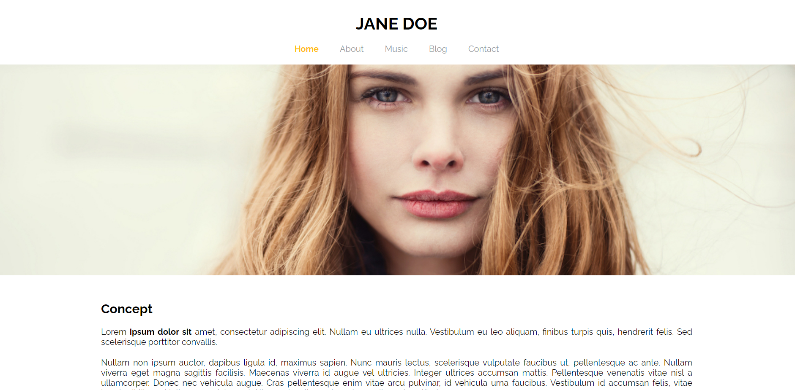

<h1 align="center"> Site Jane Doe</h1>

Site de Portfolio para Cantora Fictícia durante o curso de Front-end pela Digital House em parceria com a Estação Hack 

---

 

  

---
## 💻 Tecnologias

Esse projeto foi desenvolvido com as seguintes tecnologias:

- HTML5
- CSS3
- Javascript
- Git e Github

---

## 🚧 Projeto

Este projeto foi criado para uma Cantora Fícticia, Jane Doe (Feminino de Zé Ninguém em Inglês).

Se você quiser ver o site entre neste link: [Projeto Jane Doe](https://nigerade.github.io/Site-Jane-Doe/)

--- 
